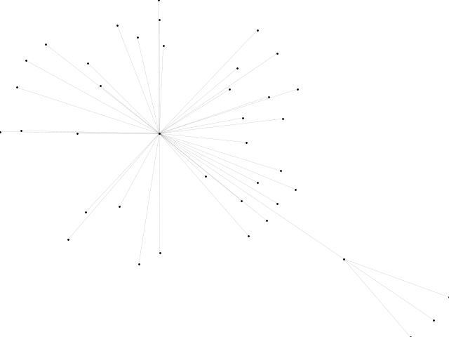
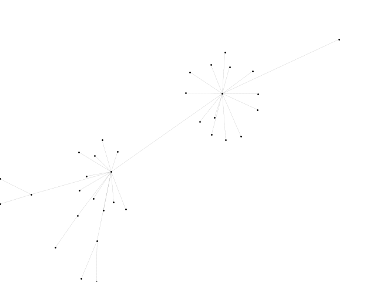
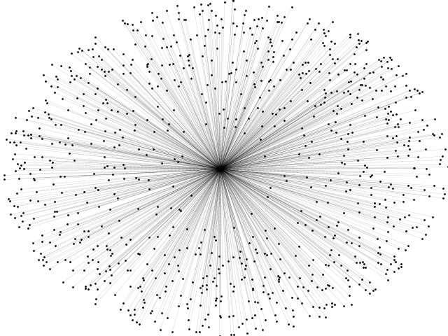

# 对Gephi动态网络图生成的统一规格化
## 原动态网络图的后图

## 处理后动态时序中的后图

## 处理后动态时序中的前图


## 运行方法
```bash	
$ python index.py XX(存放graphml的文件夹) Final.graphml(最后一个网络图包含坐标的graphml文件)
```
### 所需配置
```bash
$ pip install networkx 
$ pip install PIL(或手动安装)
```

## 我的开发思路(思维导图)


## 相关软件
**[https://github.com/gephi](https://github.com/gephi)**

**目前gephi官方还未实现此规格化功能，已向开发者团队提了建议，详情可以见issue #1906，官方已经贴上问题标签但还没回复，希望官方能够尽快解决吧**


## 后续跟进(./v2.0)
## 版本改进原理
	利用Networkx库自置的draw函数将节点和位置绑定并绘制出来，再利用matplotlib保存图片
## 可调参数(./v2.0/png_tran.py)
	with_labels=False # 是否带标签
	node_size=1 # 节点大小
	node_color='black' #节点颜色 
	width=0.15 # 边的粗细
	style='dotted' # 边的样式
## 运行方法
### 使用多进程并发处理，提高处理大规模数据的效率,n为设置的进程数

```bash	
$ python png_tran.py n
```

### ex跟第一个版本一样，需放置需要转换的graphml格式的带有每个节点坐标的图文件
	(如果没有坐标，可先用gephi-toolkit-demo先转换一下)

### **输出的png图会保存在seq_image文件夹里**

## v2.0处理后的网络图




