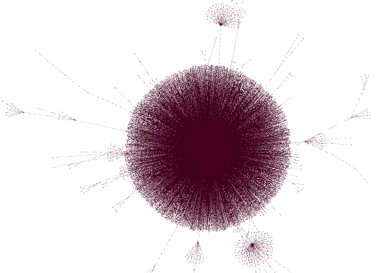
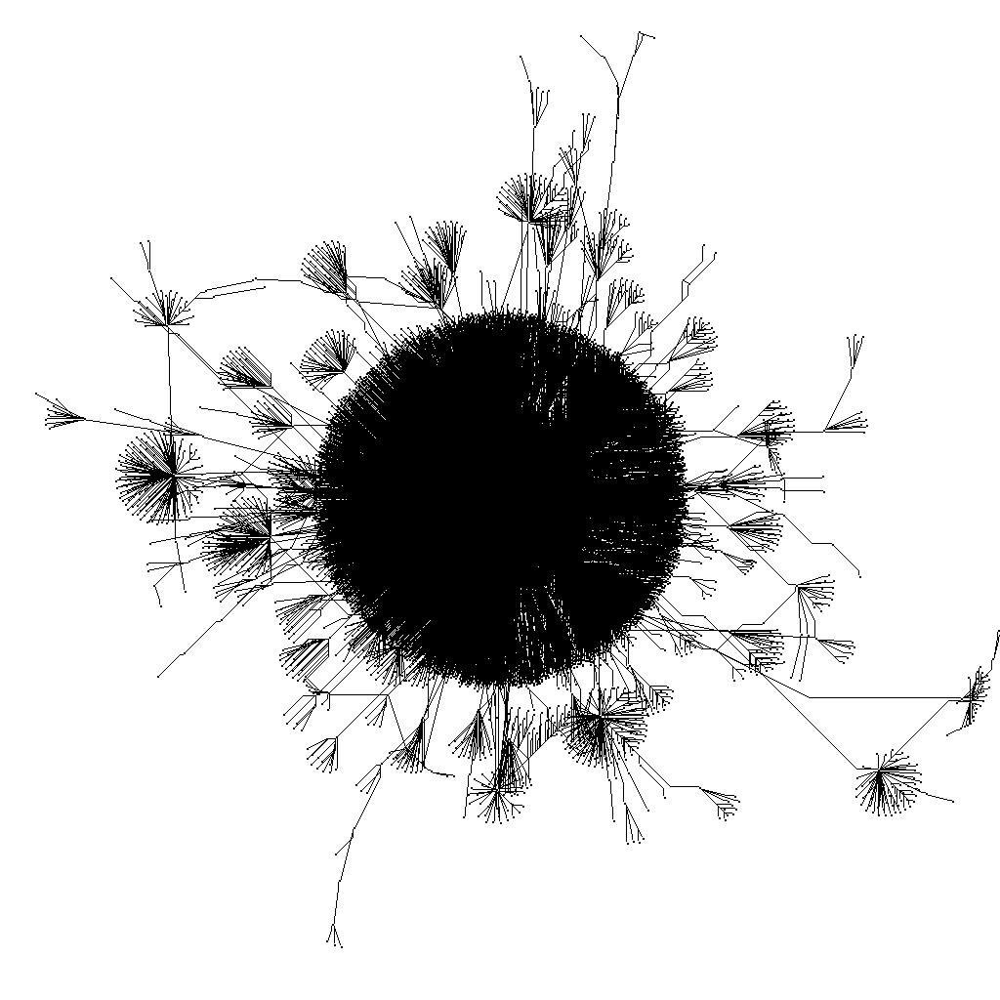
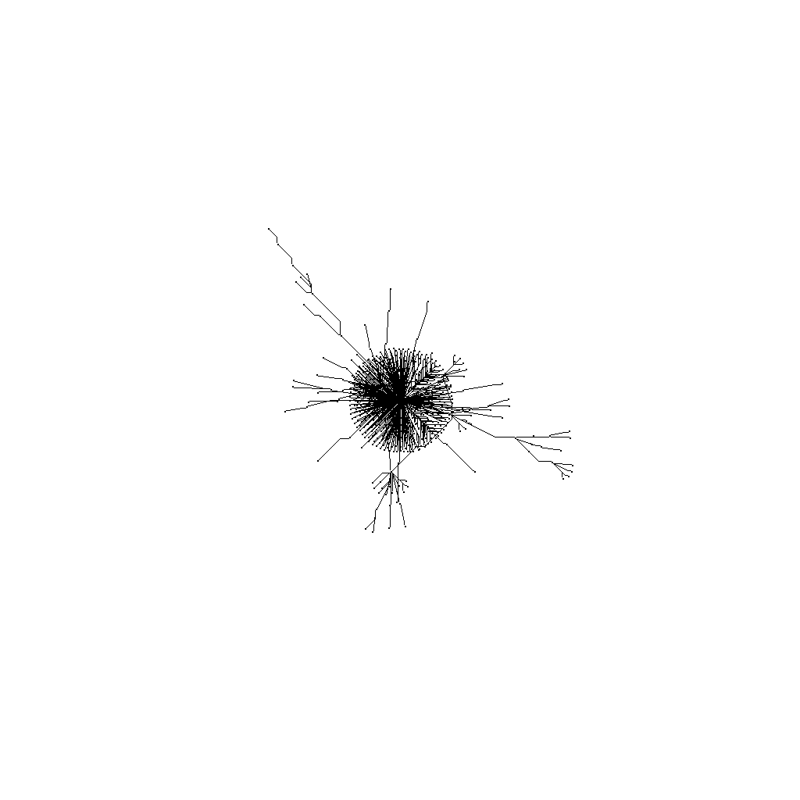
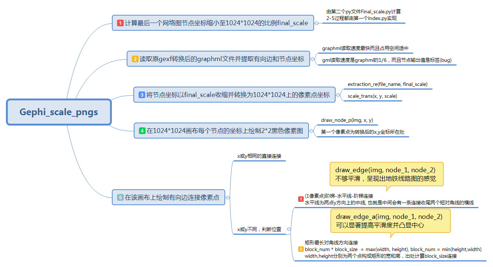

# 对Gephi动态网络图生成的统一规格化
## 原动态网络图的后图

## 处理后动态时序中的后图

## 处理后动态时序中的前图


## 运行方法
```bash	
$ python index.py XX(存放graphml的文件夹) Final.graphml(最后一个网络图包含坐标的graphml文件)
```
### 所需配置
```bash
$ pip install networkx 
$ pip install PIL(或手动安装)
```

## 我的开发思路(思维导图)



## 相关软件
**[https://github.com/gephi](https://github.com/gephi)**

**目前gephi官方还未实现此规格化功能，已向开发者团队提了建议，详情可以见issue #1906，官方已经贴上问题标签但还没回复，希望官方能够尽快解决吧**


